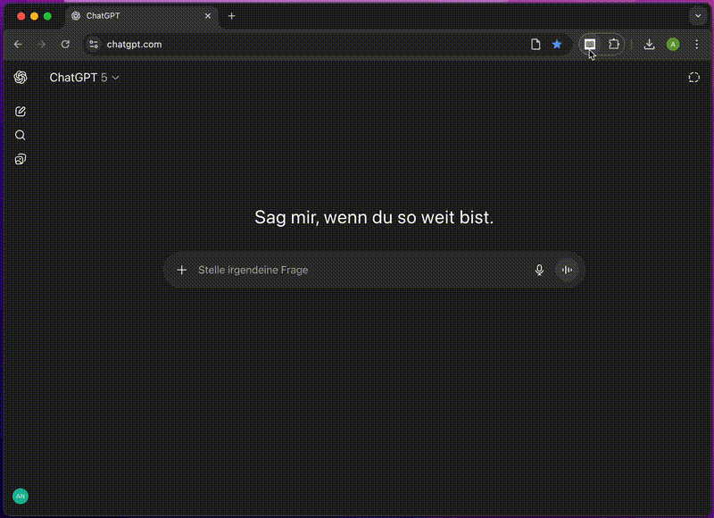
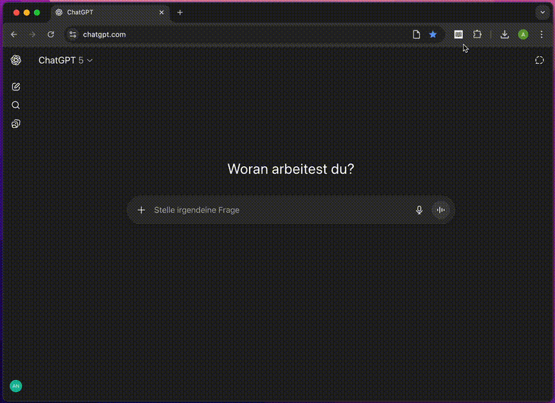
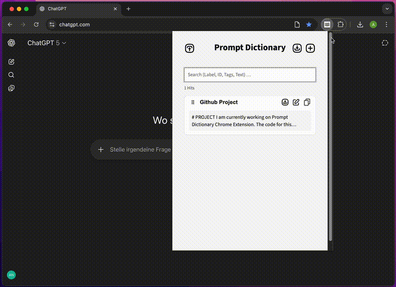
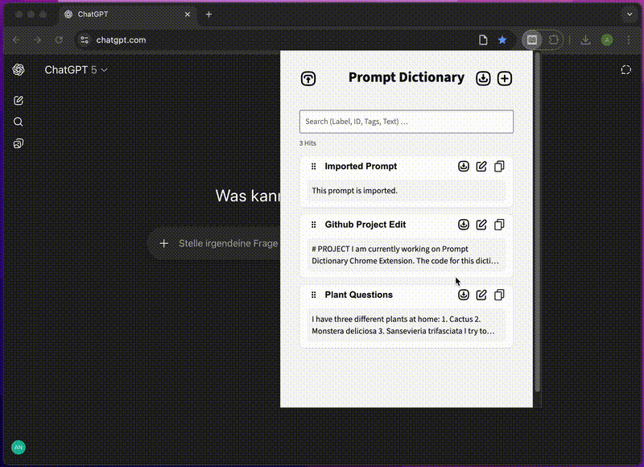
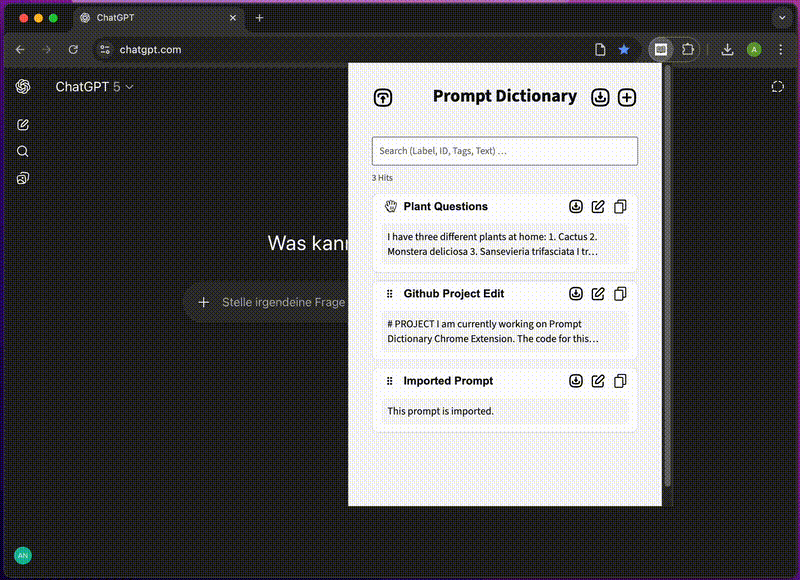
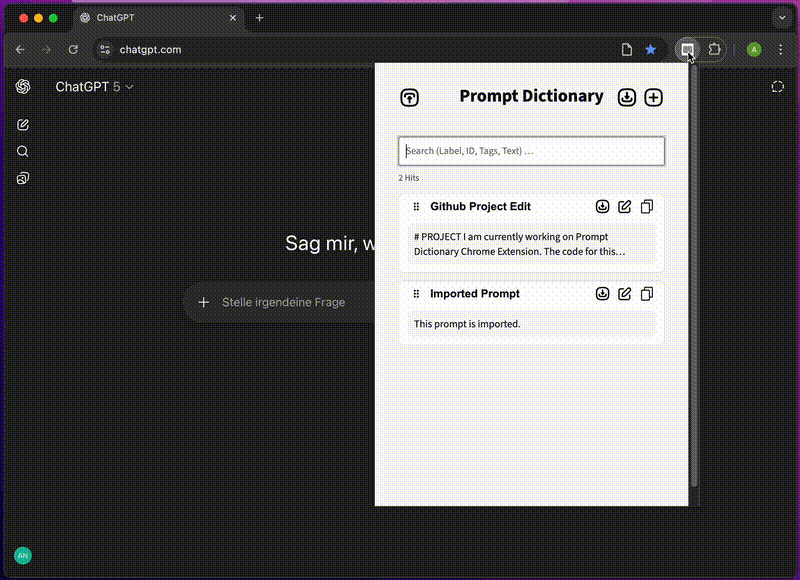
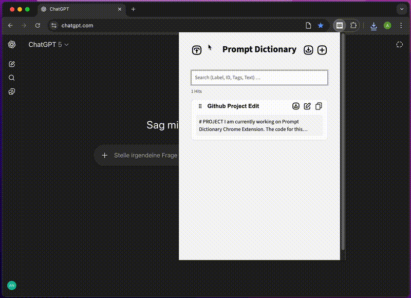
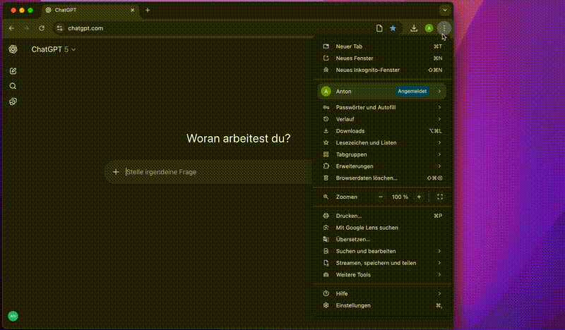

<h1 align="center">
  <br>
  <a></a>
  <br>
  Prompt Dictionary
  <br>
</h1>

<h4 align="center">A simple prompt dictionary Chrome Extension, for you to have your most important prompts easily accessible whenever you need them.</h4>

<p align="center">
  <a href="#key-features">Key Features</a> •
  <a href="#how-to-use">How To Use</a> •
  <a href="#download">Download</a> •
  <a href="#license">License</a>
</p>

## Key Features

### Adding prompts


### Copy and Use a Prompt


### Edit a Prompt


### Delete a Prompt


### Relocate and Search Prompts


### Export a Prompt


### Import a Prompt


--- 

## How To Use

### Clone this Repository
To clone and run this application, you'll need Git installed on your computer. From your command line:

```bash
# Clone this repository
$ git clone https://github.com/anton-schwarberg/prompt_dictionary.git

# Go into the repository
$ cd prompt_dictionary

```

### Adding the Extension to Chrome



## Download

You can [download](https://github.com/anton-schwarberg/prompt_dictionary/releases/tag/v1.0.0) the latest installable version of Prompt Dictionary for Windows, macOS and Linux.

## Icons

This project uses icons from [The Noun Project](https://thenounproject.com/) licensed under [CC BY 3.0](https://creativecommons.org/licenses/by/3.0/).

* add button by Rahmat Sigit Prasetyo from <a href="https://thenounproject.com/browse/icons/term/add-button/" target="_blank" title="add button Icons">Noun Project</a> (CC BY 3.0)  
* Arrow Back by Rahmat Sigit Prasetyo from <a href="https://thenounproject.com/browse/icons/term/arrow-back/" target="_blank" title="Arrow Back Icons">Noun Project</a> (CC BY 3.0)  
* Upload by Rahmat Sigit Prasetyo from <a href="https://thenounproject.com/browse/icons/term/upload/" target="_blank" title="Upload Icons">Noun Project</a> (CC BY 3.0)  
* copy by Dwi ridwanto from <a href="https://thenounproject.com/browse/icons/term/copy/" target="_blank" title="copy Icons">Noun Project</a> (CC BY 3.0)  
* edit by Gregor Cresnar from <a href="https://thenounproject.com/browse/icons/term/edit/" target="_blank" title="edit Icons">Noun Project</a> (CC BY 3.0)  

## License

MIT

---

> GitHub [@anton-schwarberg](https://github.com/anton-schwarberg/) &nbsp;&middot;&nbsp;
